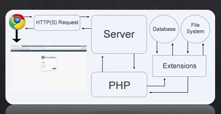

# Part 1

## What is included in this series?

* Basic principles of PHP
* PHP/Apache/MySQL Setup
* Code Syntax
* Procedural & OOP
* Dynamic Pages
* Form Submission/Superglobals
* Working with databases
* Mini Projects (Contact Form, User Login System, etc)

## What is PHP

* PHP: Hypertext Preprocessor (Recursive Acronym)
* Server Side Programming/Scripting Language
* Can be embedded directly within the HTML (<?php ?>)
* Files use a ".php" file extension

## How does PHP work?

* Client makes a requst
* Server runs PHP/extensions
* Query database if needed
* Load other files if needed
* Result is sent back to client

## Why use PHP?

* Easy to learn
* Free & Open Source
* Great Support
* Cross Platform
* Freedom
* Frameworks
* Database Compatibility

